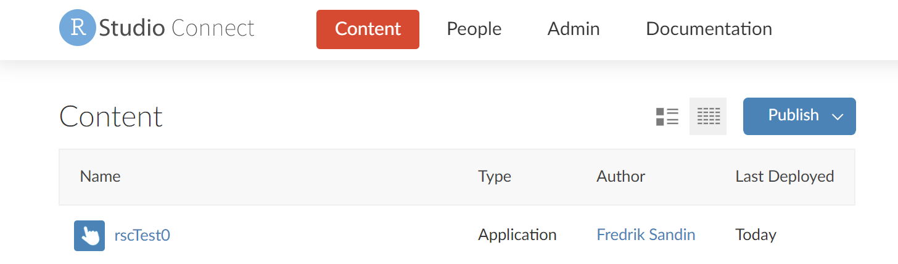
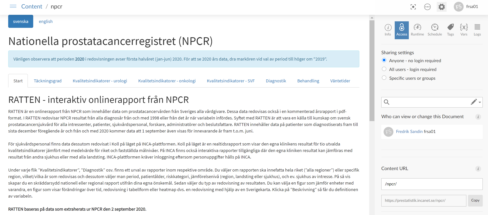

## RStudio Connect

RStudio Connect är den lösning som redan sen tidigare används på INCA-plattformen för att publicera Shiny-applikationer innanför inloggning. En ny server med liknande lösning ersätter nu den gamla Shiny-servern utanför inloggning (statistik.incanet.se). Ny produktionsserver finns på <https://prestatistik.incanet.se>. Den gamla adressen <https://statistik.incanet.se> kommer styras om till nya servern när migreringen av applikationer är klar, men även adressen <https://prestatistik.incanet.se> kommer behållas av anledningar som gås igenom under kapitlet kring serverinställningar.

På den gamla servern, som använde Shiny Server Pro, kopierade man sina applikationer via SFTP direkt till servern, vilket hade fördelen att det var väldigt enkelt, men hade nackdelen att alla applikationerna kördes på samma installation av R med samma uppsättning/versioner av paket installerade. Med RStudio Connect publiceras applikationer direkt från RStudio IDE, antingen via det grafiska gränssnittet eller via kodanrop, och de delar av den lokala R-miljön som applikationen är beroende av (dvs. de paket som applikationen använder) replikeras då i så stor utsträckning som möjligt på RStudio Connect-servern. Detta innebär att den miljö som applikationen körs i på servern kommer vara i stort sett samma när det gäller paketversioner som miljön den testkördes i lokalt.

För mer detaljerad information kring RStudio Connect, se <https://rstudio.com/products/connect/>.

### Konto och behörighet

För att använda den nya servern krävs ett konto som är synkroniserat med Active Directory. Konto erhålls genom att i första hand kontakta ens regionala supportperson för rccShiny.

### Grupper

Troligtvis kommer man vara flera individer som delar på ansvaret för att publicera applikationer för ett visst register. Det kan därför vara en bra idé att skapa grupper med användare som delar behörighet till samma applikationer, exempelvis en grupp per register eller en grupp per RCC. Grupper synkroniseras med Active Directory och för att skapa en grupp är det därför enklast att i första hand kontakta ens regionala supportperson för rccShiny.

### Webbgränssnittet

Öppna en webbläsare och navigera till servern (se webbadress ovan). Efter inloggning möts man under *Content* av en lista där alla publicerade applikationer som man har tillgång till på servern visas. Denna lista kommer troligtvis vara tom vid första inloggning. 

{width="100%"}

## Publicera från RStudio

Innan nedanstående steg genomförs för att ansluta RStudio till RStudio Connect-servern, se till att senaste versionen av RStudio är installerad (<https://rstudio.com/products/rstudio/download/>).

### Viktig information kring rccShiny

Se till att senaste versionen av rccShiny-paketet finns installerat (se <https://bitbucket.org/cancercentrum/rccshiny/>). 

För att RStudio Connect-servern ska kunna replikera installationen av rccShiny måste information kring bl.a. version och sökväg på Bitbucket finnas tillgänglig i DESCRIPTION-filen i paketets lokala installation. Om rccShiny installerats direkt från Bitbucket via anrop från RStudio behövs ingen ytterligare konfiguration då denna information då automatiskt läggs till i DESCRIPTION. Om ni tillhör de som pga. brandväggar inte har möjlighet att installera paket direkt från Bitbucket, vänligen kontakta er regionala rccShiny-stödperson som kan hjälpa till med att få tag i en DESCRIPTION-fil för korrekt paketversion (alternativt bara de kodrader som behövs) från en person som har installerat paketet via Bitbucket.

### Serverinställningar

Första steget för att kunna publicera applikationer är att lägga till RStudio Connect-servern i RStudio. Detta görs genom att gå till *Global Options... -> Publishing*. Tryck på *Connect*, välj *RStudio Connect* och skriv in servern **prestatistik.incanet.se**. I nästa steg öppnas en sida i ens webbläsare där man behöver ange användarnamn och lösenord till RStudio Connect-servern. Om sidan inte öppnas automatiskt, klicka på *Confirm account on prestatistik.incanet.se*.

{width="100%"}

### Publicera via grafiskt gränssnitt

När man i RStudio öppnar ett dokument av en typ som stöds för publicering (i exemplet nedan en Shiny-applikation), kommer en blå ikon *Publish* dyka upp i övre högra hörnet. Klickar man på ikonen kan man via grafiska gränssnittet publicera applikationen. 

{width="100%"}

\  

{width="100%"}

\  

Publiceringen kan ta lite tid beroende på hur många paket applikationen är beroende av, samt hur många av dessa som redan finns cachad på servern sen tidigare. Om allt går som det ska kommer man få ett meddelande i stil med:
```{r eval=FALSE}
Application successfully deployed to https://prestatistik.incanet.se/content/379/
```
Applikationen kan nås via adressen i meddelandet, och dyker upp i listan på applikationer under *Content* i webbgränssnittet.

{width="100%"}

Observera att publicering via *Publish*-knappen kan krångla om sökvägen till applikationen innehåller specialtecken (t.ex. åäö). Detta verkar dock inte vara något problem om man publicerar via kodanrop enligt nedan.

### Publicera via kodanrop

Ska man publicera många applikationer blir det väldigt tidskrävande att använda tillvägagångssättet ovan. Som tur är finns ett R-paket [rsconnect](https://rstudio.github.io/rsconnect/) som kan hantera publiceringen via kodanrop. Funktionen **rsconnect::deployApp** kan anropas för att publicera en applikation. Sökvägen till applikationen kan anges i parametern **appDir** om man inte redan står i mappen där applikationen ligger. Det finns även möjlighet att ange applikationens namn via **appName** (anges inget används mappens namn). Det finns även möjlighet att ange vilken server och vilket konto som ska användas i det fallet om man har flera RStudio Connect-servrar konfigurerade i RStudio. Se funktionens hjälpfil för mer information.

{width="100%"}

\  

Ska man publicera många applikationer kan man således enkelt loopa igenom och publicera samtliga applikationer med hjälp av detta anrop. Se exempel i kommande kapitel kring rekommenderat arbetssätt. 

### Exempel: Publicering av rccShiny-applikation

Vi börjar med att skapa en testapplikation genom att använda testdata från rccShiny-paketet:
```{r eval=FALSE}
rccShiny::rccShiny2(
  data = rccShinyData,
  folder = "rccShinyTest1",
  outcome = paste0("outcome", 1:3),
  outcomeTitle = c("Dikotom", "Kontinuerlig", "Kategorisk")
)
```
Nästa steg är att publicera applikationen på servern:
```{r eval=FALSE}
rsconnect::deployApp(
  appDir = "rccShinyTest1", 
  forceUpdate = TRUE
)
```
Genom att ange **forceUpdate = TRUE** behöver vi inte bekräfta att vi vill uppdatera applikationen ifall den redan finns publicerad sen tidigare.

### Kommentar kring långa laddningstider för publicering av applikation

I tidigare versioner av paketet *rsconnect* fanns ett problem med långa laddningstider  vid publicering (ca 2 minuter per applikation). Detta är nu löst och numera tar det ca 10-15 sekunder per applikation, vilket får anses vara acceptabelt. Upplever du långa laddningstider vid publicering, vänligen kontrollera att du har senaste versionen av paketet installerad.

## Inställningar

### Behörighet (*Sharing settings*)

Som default är en publicerad applikation inte tillgänglig för vem som helst. Under inställningarna för respektive applikation finns en sektion *Sharing settings* som anger vilka som har rätt att ladda applikationen. När man först publicerar applikationen kommer valet *Specific users or groups* vara förvalt, och för att göra applikationen publik måste detta ändras till valet *Anyone - no login required*. Detta kan göras manuellt i webbgränssnittet eller via API-anrop (se exempel i kommande kapitel kring rekommenderat arbetssätt), och behöver bara göras en gång per applikation. När man uppdaterar en redan publicerad applikation behålls inställningarna.

{width="100%"}

### *Content URL*

Under inställningarna för respektive applikation finns även möjlighet att använda ett så kallat *Content URL*. Som default nås applikationen via sökvägen <https://prestatistik.incanet.se/content/id/>, där *id* är applikationens id-nummer. 

I exemplet nedan kan applikationen även nås via <https://prestatistik.incanet.se/rscTest0/>.

{width="100%"}

\  

*Content URL* ska användas för att förenkla sökvägen till själva menysidan (index.html) för respektive register (se följande kapitel). Sökvägen ska sättas till motsvarande från gamla servern så att länkarna under *"Statistik" -> "Interaktiva rapporter"* på [cancercentrum.se](https://cancercentrum.se/samverkan/vara-uppdrag/statistik/kvalitetsregisterstatistik/interaktiva-rapporter/) fortfarande fungerar. *Content URL* kan även anges för varje enskild applikation, vilket i sin tur minimierar ändringarna som behöver göras i index.html.

Observera att dessa URL inte kan vara nästade i varandra. Om man t.ex. ställt in URL för sin menysida till <https://prestatistik.incanet.se/registernamn> så kan man inte sätta *Content URL* för en applikation till t.ex. **/registernamn/sv/applikation1**. Det rekommenderas att man istället då använder **/registernamn_sv_applikation1**. Se kommande kapitel för hur index.html måste modifieras för att tillgodose detta.

*Content URL* kan enkelt sättas via API-anrop (se exempel i kommande kapitel kring rekommenderat arbetssätt).

Alternativt kan man i index.html ange sökvägen till applikationerna baserat på deras id-nummer. 

## Publicering av menysidan (index.html)

Det går utmärkt att även publicera statiska dokument, t.ex. webbsidor. Vi kan därför använda liknande tillvägagångssätt som ovan för att publicera själva menysidan (index.html) som ska länka till alla Shiny-applikationer. Om vi i RStudio navigerar till mappen där vi har sparat **index.html** och tillhörande undermappen ___libs__ kan vi sedan publicera genom anropet:
```{r eval=FALSE}
# Lista filer att publicera (index.html samt alla filer i undermappen _libs)
tempAppFiles <- c("index.html", list.files("_libs", full.names = TRUE, recursive = TRUE))
# Inspektera filer
tempAppFiles
# Publicera
rsconnect::deployApp(
  appDir = ".",
  appFiles = tempAppFiles,
  appName = "registernamn",
  appPrimaryDoc = "index.html",
  logLevel = "quiet",
  forceUpdate = TRUE
)
```

Sidan finns sedan publicerad på servern under det angivna namnet ovan.

{width="100%"}

\  

{width="100%"}

\  

Observera att vi i exemplet ovan även angivit ett *Content URL* **/npcr/** vilket innebär att denna sida utöver att vara tillgänglig under den vanliga sökvägen baserat på id också finns tillgänglig under <https://prestatistik.incanet.se/npcr/>.

## Rekommenderat arbetssätt

Själva framtagandet av applikationer baserade på rccShiny kommer inte ändras i och med övergången till RStudio Connect. Applikationerna tas fram lokalt på datorn på samma sätt som tidigare, vilket innebär att man kommer ha en mapp med en mängd undermappar som varje innehåller en rccShiny-applikation.

<span style="color:red;">Kom ihåg att alltid använda den senaste versionen av rccShiny-paketet!</span>

<span style="color:red;">När övergången till nya servern är klar kommer adressen <b>statistik.incanet.se</b> pekas om mot nya RStudio Connect-servern. Men även adressen <b>prestatistik.incanet.se</b> kommer fortsätta peka mot nya servern eftersom denna adress har använts vid publiceringen av applikationer under övergångsperioden. Försöker man sen publicera samma applikation men istället till <b>statistik.incanet.se</b> kommer det tolkas som att den ska publiceras under nytt id, om man inte explicit anger vilket id som ska användas (se kapitlet angående att uppdatera en redan publicerad applikation). För enkelhetens skull är det rekommenderat att tills vidare även efter övergången fortsätta publicera mot <b>prestatistik.incanet.se</b>.</span>

### Publicera applikationer med en loop

Genom att använda **rsconnect::deployApp** kan vi enkelt loopa igenom och publicera alla våra appar.

<span style="color:red;">Kom ihåg att ändra *registernamn* i nedanstående kod till prefixet som ska användas av det aktuella registret!</span>
```{r eval=FALSE}
# Lista alla undermappar under nuvarande working directory
tempListApps <- list.dirs(full.names = FALSE, recursive = FALSE)
# Loopa igenom och publicera varje mapp/app
for (i in 1:length(tempListApps)) {
  # Visa ett meddelande med progress
  print(paste0("Publishing (", i, "/", length(tempListApps), "): ", tempListApps[i]))
  # Dölj alla meddelanden
  suppressMessages(
    suppressWarnings(
      rsconnect::deployApp(
        appDir = tempListApps[i],
        # Rekommenderar att ett mer unikt namn sätts genom ett prefix 
        # Förslagsvis används register samt språk som prefix
        appName = paste0("registernamn_sv_", tempListApps[i]),
        logLevel = "quiet",
        forceUpdate = TRUE
      )
    )
  )
}
```

### Förbereda för API-anrop från RStudio

Efter att man har publicerat sin applikation kan man göra ytterligare inställningar via så kallade API-anrop direkt från RStudio. För att förbereda för detta måste man skapa en *API Key* för sin användare. Detta görs under ens egen användares profil under *People* i webbgränssnittet. När man skapat en *API Key* kan denna kopieras och klistras in i RStudio enligt exemplen i följande kapitel.

{width="100%"}

För att göra API-anropen direkt från RStudio används paketet [connectapi](https://github.com/rstudio/connectapi). Paketet finns inte på CRAN utan installeras enklast från GitHub via anropet:
```{r eval=FALSE}
remotes::install_github("rstudio/connectapi")
```

Har man inte möjlighet att installera direkt från GitHub kan man tanka hem paketet som .zip-fil från <https://github.com/rstudio/connectapi> och sedan installera lokalt via:
```{r eval=FALSE}
devtools::install_local("connectapi-master.zip")
```

### Justera *Sharing settings*, skrivrättigheter och *Content URL* med API-anrop

Som nämndes tidigare krävs det för att en publicerad applikation ska bli publik att *Sharing settings* ändras till *Anyone - no login required*. I nedanstående kodexempel hämtas först en lista över publicerade applikationer på servern. <span style="color:red;">Pga. en begränsning i hur mycket information som kan returneras av anropet som hämtar denna lista behöver vi begränsa förfrågan. På servern finns numera så många applikationer publicerade att om man försöker hämta hela denna lista via API-anrop returneras endast ett error. Vi får därför begränsa förfrågan till applikationer med en specifik ägare.</span> Ur listan väljs sedan de applikationer som man vill justera ut, till exempel endast de vars namn har ett visst prefix (här kan såklart andra urval göras, t.ex. på användarnamn). En loop går sedan igenom applikationerna och justerar *Sharing settings*.

I samma loop justeras även så att de användarnamn och gruppnamn som angetts i **tempListAddCollaboratorUsers** respektive **tempListAddCollaboratorGroups** ges skrivrättigheter till applikationerna.

Slutligen läggs även ett *Content URL* till för varje applikation, så en applikation med namnet **registernamn_sv_applikation1** får URL <https://prestatistik.incanet.se/registernamn_sv_applikation1>. 

Vill man inte justera skrivrättigheter eller *Content URL* kan självklart de delarna av koden nedan tas bort.

<span style="color:red;">Kom ihåg att ändra *registernamn* i nedanstående kod till prefixet som ska användas av det aktuella registret!</span>
```{r eval=FALSE}
# Serveradress (justeras till produktionsservern om så behövs) och API Key
connectServer <- "https://prestatistik.incanet.se" 
connectAPIKey <- "..."

# Definiera uppkoppling för att använda i funktionerna i paketet connectapi
client <- connectapi::connect(
  server = connectServer,
  api_key = connectAPIKey
)

# Hämta lista på användare och grupper på servern
tempUsers <- connectapi::get_users(client)
tempGroups <- connectapi::get_groups(client)

# Hämta GUID för den användare vars appar man vill lista
tempOwnerGUID <- tempUsers$guid[tempUsers$username %in% "..."]

# Hämta lista på alla applikationer på servern och välj ut de där namnet innehåller "registernamn_sv_"
# (Observera att ens användare måste ha skrivrättigheter till de applikationer man önskas justera)
tempListApplications <- connectapi::get_content(client, owner_guid = tempOwnerGUID) %>% 
  dplyr::filter(stringr::str_detect(name, "registernamn_sv_"))

# Definiera vilka användarnamn respektive gruppnamn som ska ges skrivrättigheter till applikationerna
tempListAddCollaboratorUsers <- c("testUser1", "testUser2")
tempListAddCollaboratorGroups <- c("grp.usr.stat.testGroup1")

# Loopa igenom alla applikationer i urvalet
for (i in 1:nrow(tempListApplications)) {
  # Skapa ett objekt av typ connectapi::Content för applikation 
  tempContent <- 
    connectapi::content_item(
      connect = client, 
      guid = tempListApplications$guid[i]
    )
  
   # Sätt Sharing settings till "all"
  tempContent$update(access_type = "all")
  
  # Lägg till användare
  for (j in tempListAddCollaboratorUsers) {
    if (j %in% tempUsers$username) {
      connectapi::acl_add_user(
        content = tempContent, 
        user_guid = tempUsers$guid[tempUsers$username %in% j], 
        role = "owner"
      )
    }
  }
  # Lägg till grupper
  for (j in tempListAddCollaboratorGroups) {
    if (j %in% tempGroups$name) {
      connectapi::content_add_group(
        content = tempContent, 
        guid = tempGroups$guid[tempGroups$name %in% j], 
        role = "owner"
      )
    }
  }
  
  # Sätt Content URL
  connectapi::set_vanity_url(
    content = tempContent, 
    url = paste0("/", tempListApplications$name[i])
  )
}

```

### Menysidan (index.html)

Ett krav är att använda *Content URL* för menysidan (index.html), dvs. till exempel ange *Content URL* **/registernamn/**, vilket gör att startsidan får en sökväg som motsvarar länken från *"Statistik" -> "Interaktiva rapporter"* på [cancercentrum.se](https://cancercentrum.se/samverkan/vara-uppdrag/statistik/kvalitetsregisterstatistik/interaktiva-rapporter/).

<span style="color:red;">Observera att <i>Content URL</i> på nya servern är case-sensitive, vilket innebär att <b>/registernamn/</b> och <b>/Registernamn/</b> motsvarar två olika adresser. Se alltså till att menysidans adress motsvarar exakt den i länken från cancercentrum.se.</span>

Sökvägarna till respektive applikation måste justeras i index.html till att överensstämma med nya servern. Har man angett ett *Content URL* för varje applikation enligt tidigare kapitel så behövs endast en minimal justering göras. Exempelvis kanske man på den gamla servern hade en applikation under sökvägen <https://statistik.incanet.se/registernamn/sv/applikation1>. Om man på nya servern har angett *Content URL* **/registernamn_sv_applikation1** kommer följande justering i index.html behövas. Ersätt där raden
```{r eval=FALSE}
src = language+'/'+link_id;
```
med
```{r eval=FALSE}
src = '/registernamn_'+language+'_'+link_id;
```

Om man väljer att inte sätta *Content URL* för varje enskild applikation behöver man istället använda sökvägen baserat på id, dvs. <https://prestatistik.incanet.se/content/id/>, där *id* är applikationens id-nummer. Då behöver större justeringar göras i index.html. För att enkelt få tag på applikationernas id-nummer kan följande anrop användas i RStudio lokalt för att visa en lista på alla ens publicerade applikationer:
```{r eval=FALSE}
rsconnect::applications()
```
Alternativt kan man använda API-anrop för att lista samtliga publicerade applikationer på servern (se kapitlet kring API-anrop ovan). I index.html kan följande småjusteringar göras för att sökvägarna baserat på *id* ska fungera på nya servern: 

Ersätt raden
```{r eval=FALSE}
src = language+'/'+link_id;
```
med
```{r eval=FALSE}
src = '/content/'+link_id;
```
I varje länk behöver applikationens namn ersättas med motsvarande nya id. T.ex. om applikationen *mdk* nu fått id *99* ersätts
```{r eval=FALSE}
<li class='reportLi'><a data-toggle='pill' href='#reportDiv' class='reportLink' id='mdk'>Multidisciplinär konferens</a></li>
```
med
```{r eval=FALSE}
<li class='reportLi'><a data-toggle='pill' href='#reportDiv' class='reportLink' id='99'>Multidisciplinär konferens</a></li>
```

### Uppdatera redan publicerad applikation
  
När man publicerat en applikation kommer det skapas en katalog *rsconnect* lokalt i mappen där applikationen ligger. Denna innehåller information om var publiceringen är gjord, och ska man uppdatera en redan publicerad applikation är det därför viktigt att undermappen *rsconnect* finns kvar. Försöker man istället publicera samma applikation men utan att *rsconnect*-mappen finns kommer det tolkas som att applikationen ska publiceras på nytt (under nytt id) istället för att den som redan är publicerad ska uppdateras.
  
Som nämndes tidigare kan man vara flera användare som delar på skrivrättigheter till en applikation (t.ex. via en grupp). Om en annan användare än den som publicerade applikationen första gången behöver göra en uppdatering är det viktigt att ange applikationens *id* explicit i parametern **appId** i anropet till **rsconnect::deployApp**. Anger man inte detta kommer servern tolka det som att den andra användaren vill publicera applikationen under ett helt nytt *id*.

Till exempel kan följande justerade kod användas för att publicera applikationer genom att först kolla upp ifall en applikation med samma namn redan finns på servern och i sådana fall uppdatera den istället för att publicera under nytt *id*.
```{r eval=FALSE}
# Prefix för register ----------------------------------------------------------
globalRegisterPrefix <- "registernamn"

# API --------------------------------------------------------------------------
connectServer <- "https://prestatistik.incanet.se" 
connectAPIKey <- "..."

client <- connectapi::connect(
  server = connectServer,
  api_key = connectAPIKey
)

# Hämta lista på användare och grupper på servern
tempUsers <- connectapi::get_users(client)
tempGroups <- connectapi::get_groups(client)

# Hämta GUID för den användare vars appar man vill lista
tempOwnerGUID <- tempUsers$guid[tempUsers$username %in% "..."]

# Hämta lista på alla applikationer på servern och välj ut de där namnet innehåller prefix
# (Observera att ens användare måste ha skrivrättigheter till de applikationer man önskas justera)
tempListApplications <- connectapi::get_content(client, owner_guid = tempOwnerGUID) %>% 
  dplyr::filter(stringr::str_detect(name, globalRegisterPrefix))

# Publicera appar --------------------------------------------------------------
# Lista alla undermappar under nuvarande working directory
tempListApps <- list.dirs(full.names = FALSE, recursive = FALSE)
# Loopa igenom och publicera varje mapp/app
for (i in 1:length(tempListApps)) {
  # Visa ett meddelande med progress
  print(paste0("Publishing (", i, "/", length(tempListApps), "): ", tempListApps[i]))
  # Kontrollera om en app med samma namn finns på servern redan, uppdatera den i sådana fall
  tempDfAppId <- tempListApplications %>% 
    dplyr::filter(name %in% paste0(globalRegisterPrefix, "_sv_", tempListApps[i])) %>% 
    dplyr::arrange(id) %>% 
    dplyr::distinct(id)
  if (nrow(tempDfAppId) > 0) {
    tempAppId <- tempDfAppId$id
  } else {
    tempAppId <- NULL
  }
  # Dölj alla meddelanden
  suppressMessages(
    suppressWarnings(
      rsconnect::deployApp(
        appDir = tempListApps[i],
        # Rekommenderar att ett mer unikt namn sätts genom ett prefix 
        # Förslagsvis används register samt språk som prefix
        appName = paste0(globalRegisterPrefix, "_sv_", tempListApps[i]),
        # Appens id
        appId = tempAppId,
        logLevel = "quiet",
        forceUpdate = TRUE
      )
    )
  )
}
```
