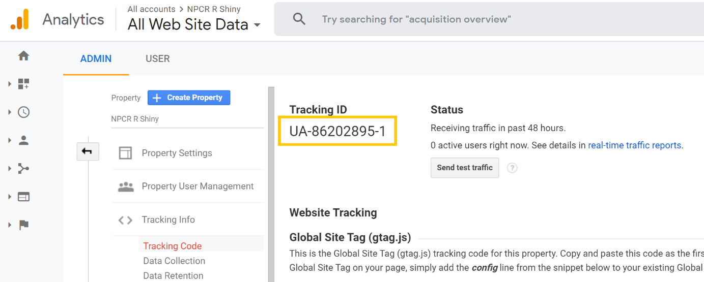
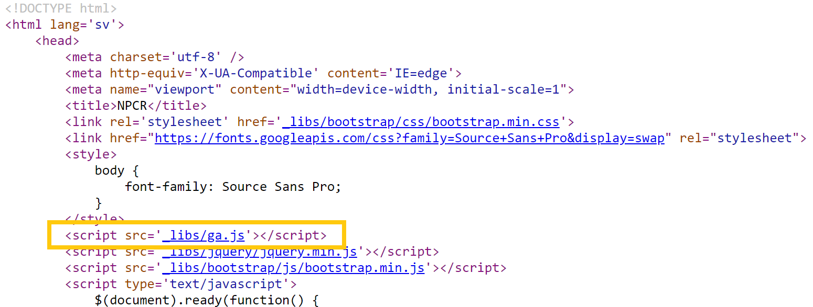

## Vad är Google Analytics?

Google Analytics är ett gratis verktyg för att visa statistik kring användandet av en webbplats. Verktyget kan användas för att studera en mängd olika parametrar, men det mest grundläggande syftet är att ta reda på hur många besökare ens webbplats har, samt att t.ex. analysera vilka underliggande sidor som användare besöker mest.

## Google Analytics och rccShiny

I rccShiny finns redan inbyggd funktionalitet för att koppla den resulterande shiny-applikationen till Google Analytics. Nedan följer instruktioner för hur man går till väga för att få detta på plats för sitt registers interaktiva årsrapport på statistik.incanet.se.

### Steg 1: Skapa ett Google Analytics-konto för ert registers interaktiva årsrapport

Att komma igång med Google Analytics går väldigt enkelt genom att följa instruktionerna här:  
https://support.google.com/analytics/answer/1008015?hl=sv

Viktigt att tänka på är att ni endast behöver skapa en så kallad "egendom" för hela er interaktiva årsrapport, dvs. ni behöver inte skapa en egendom för varje shiny-applikation.

### Steg 2: Skapa en .js-fil innehållande koppling till Google Analytics

Vi kommer nu behöva spara ner en .js-fil innehållande lite JavaScript-kod som refererar till er egendoms spårnings-id. Instruktioner för att hitta denna kod finns i nedanstående länk samt i exemplet i nedanstående skärmdump:  
https://support.google.com/analytics/answer/1008080

{width="100%"}

Använd nu en texteditor för att skapa en .js-fil med valfritt namn (t.ex. ga.js) och klistra in nedanstående kod där ni också ersätter **UA-XXXXX-Y** med er eget spårnings-id.

Observera att raden innehållande *anonymizeIp* är viktig då den förhindrar Google från att lagra besökares fullständiga IP-adress.

```javascript
(function(i,s,o,g,r,a,m){i['GoogleAnalyticsObject']=r;i[r]=i[r]||function(){
(i[r].q=i[r].q||[]).push(arguments)},i[r].l=1*new Date();a=s.createElement(o),
m=s.getElementsByTagName(o)[0];a.async=1;a.src=g;m.parentNode.insertBefore(a,m)
})(window,document,'script','https://www.google-analytics.com/analytics.js','ga');

ga('create', 'UA-XXXXX-Y', 'auto');
ga('set', 'anonymizeIp', true);
ga('send', 'pageview');
```

### Steg 3: Kopiera .js-filen till servern

Ladda nu upp .js-filen till ert registers katalog på statistik.incanet.se, förslagsvis under underkatalogen "\_libs". I exemplet för NPCR ligger därmed filen under sökvägen:  
https://statistik.incanet.se/npcr/_libs/ga.js

### Steg 4: Justera anropet till rccShiny

I anropet till rccShiny kan man ange sökvägen till ens .js-fil i en parameter med namnet **gaPath**. I exemplet för NPCR anges därför följande parameter vid skapandet av varje rccShiny-applikation:

```{r, eval = FALSE}
rccShiny2(
  ...,
  gaPath = "/npcr/_libs/ga.js"
)
```

Ersätt således sökvägen ovan med korrekt sökväg till .js-filen för er interaktiva årsrapport. Ni behöver inte ange https://statistik.incanet.se i början av sökvägen. När sökvägen börjar med / antas sökvägen referera till den server som sidan ligger på.

### Steg 5: Lägg till referens till Google Analytics i index.html

Utöver att spåra besökare på varje rccShiny-applikation vill ni säkert också vilja kunna spåra hur många besökare ni har på själva menysidan (index.html). Detta görs genom att lägga till följande kodsnutt i \<head\>-sektionen i index.html (nedanstående exempel förutsätter att .js-filen heter ga.js och ligger i en katalog "\_libs" som är en underkatalog till katalogen där index.html ligger):

```html
<script src='_libs/ga.js'></script>
```

I exemplet för NPCR kan det således se ut som såhär:

{width="100%"}

### Steg 6: Verifiera

Verifiera gärna att allt funkar genom att besöka menysidan samt några rapporter och kontrollera att besöken loggas i Google Analytics. Vid frågor, hör i första hand av er till er regionala rccShiny-stödperson.
