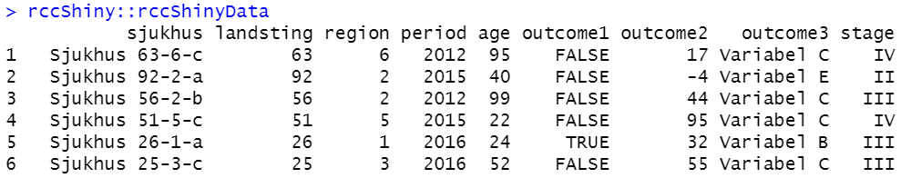
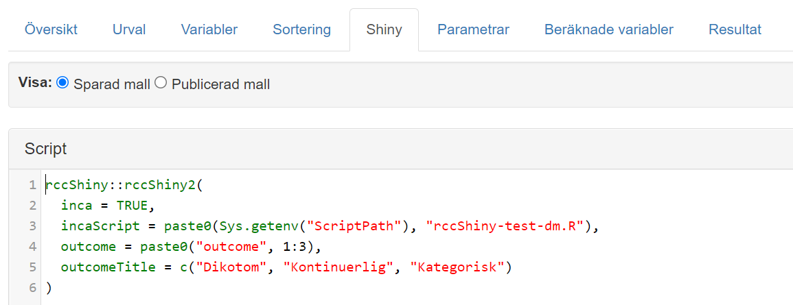
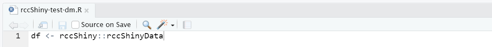
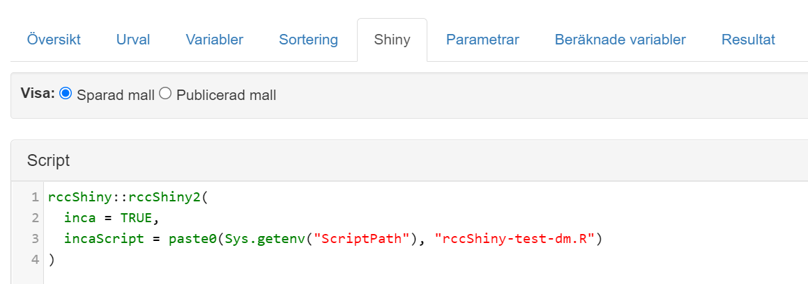
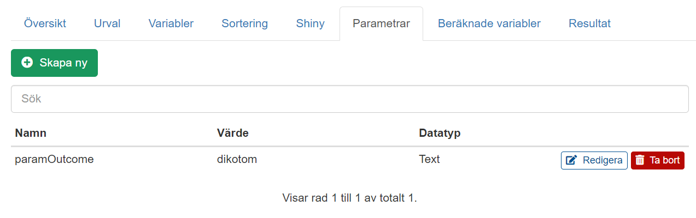
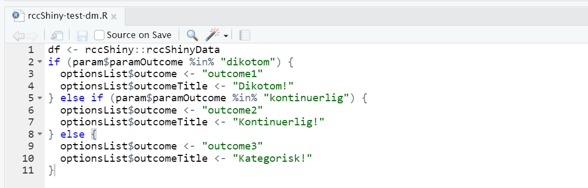

## Allmänt om att använda rccShiny på INCA
När man lokalt på egna datorn använder funktionen rccShiny2 från rccShiny-paketet för att skapa en app skickar man in ett redan preparerat dataset som en av parametrarna. Detta dataset innehåller då vissa variabler i en viss struktur som krävs av rccShiny2. Vi går inte in i detaljer kring detta i denna guide, för mer info se hjälpavsnittet till rccShiny:
```{r eval=FALSE}
?rccShiny2
```
Ett exempelanrop till rccShiny2, som använder det testdata som inkluderas i paketet, kan då se ut så här:
```{r eval=FALSE}
rccShiny::rccShiny2(
  data = rccShinyData,
  folder = "rccShinyTest1",
  outcome = paste0("outcome", 1:3),
  outcomeTitle = c("Dikotom", "Kontinuerlig", "Kategorisk")
)
```
Dataramen **rccShinyData** har här följande struktur: 

{width="100%"}

\ 

När vi vill använda rccShiny2 på motsvarande sätt inne på INCA behöver vi göra först göra ett par justeringar i anropet. Istället för att anropa funktionen med ett redan preparerad dataset i parametern **data** sätter vi parametern **inca = TRUE** samt anger en sökväg i parametern **incaScript** till det R-skript som ska köras efter att specificerade dataramar i INCA-mallen har laddats in i R-sessionen. Tanken är att detta skript ska ta inladdade data och förbereda dessa så att det efter att skriptet körts finns en dataram **df** i sessionen som uppfyller samma krav på innehåll och struktur som ett dataset man hade skickat in i rccShiny2 om man hade jobbat lokalt. Ett motsvarande exempelanrop som det ovan, där vi alltså planerar använda det testdata som inkluderas i paketet, kan då se ut som följande:

{width="100%"}

\ 

Skriptet **rccShiny-test-dm.R** på RStudios filarea ska då innehålla all data management som krävs för att få till en dataram **df** som uppfyller kraven på innehåll och struktur. När vi i detta fall endast planerar använda **rccShinyData** (som redan uppfyller dessa krav) behöver detta skript endast innehålla en rad:

{width="100%"}

\ 

## Det "vanliga" sättet att skapa flera rccShiny-appar på INCA
Det "vanliga" sättet att skapa flera rccShiny-appar/rapporter på INCA är att skapa en separat mall för varje app, där separat kod används i varje mall för att anropa funktionen rccShiny2. Även om man anropar koden från RStudios filarea blir detta tillvägagångssätt snabbt jobbigt att hantera då INCA kräver att mallen publiceras om för att ändringar i koden ska slå igenom. Vill man t.ex. göra samma typ av justering i alla sina 25 st rccShiny-mallar måste man då publicera om 25 st mallar. 

## Att använda en "generisk mall" för flera rccShiny-appar på INCA
### Vad menas här med en "generisk mall"?
Många av oss har nog för rapporter som inte använder rccShiny på INCA använt en typ av generisk mall som grund. Det kan då t.ex. handla om att använda en mall där vilken redovisning som görs styrs av en mallparameter som hanteras i själva R-koden. Med detta arbetssätt behöver bara en enda mall underhållas, medan i princip all justering görs i tillhörande R-kod som lagras på RStudios filarea. 

### Svårigheten med att skapa en "generisk mall" för rccShiny-appar
Tyvärr kan man inte använda samma arbetssätt när det gäller rapporter som använder sig av rccShiny. Detta beror på att mallparametrar laddas in i R-sessionen först i själva server-delen av Shiny-appen, dvs. efter det att anropet till rccShiny redan skett. Anropet till rccShiny kan alltså då inte längre anpassas utifrån mallparametervärden. Som tur är finns i workaround som gör att output från en rccShiny-mall ändå kan styras baserat på mallparameterar.

### Workaround
Funktionen rccShiny2 laddar som bekant in mallens data (och därmed också mallparameterar) och kör sedan R-skriptet vars sökväg angetts i **incaScript**. Mallparametrarna finns alltså tillgängliga när koden i incaScript körs. Vi kan därför använda koden i incaScript för att anpassa output efter värdet på en mallparameter, dvs. ersätta värden som rccShiny2 använder med nya värden. Men för att göra det behöver vi veta var saker och ting lagras av rccShiny2.

Alla parametrar i rccShiny2 lagras till slut i ett objekt av typen *list* med namnet **optionsList**, där varje parameter ligger som ett listvärde med sitt motsvarande namn. Vi kan därför göra ett minimalt anrop till rccShiny2, dvs. lämna nästan allt på default-värden, och sedan i vårt incaScript-skript ersätta värdena i optionsList med nya önskade värden, och den resulterande appen kommer anpassas därefter (eftersom hela UI etc. laddas efter att incaScript-skriptet körts).

En viktig sak att ta höjd för i denna workaround är att vissa parametrar som man i anropet till rccShiny2 kan ange som vektorer senare lagras i optionsList som listor. Detta beror på att rccShiny2 är anpassat för att lokalt med ett anrop kunna generera flera versioner av samma app men på olika språk, där parametervärden för olika språk anges i listor. Vi måste därför se till att ersätta värdena i optionsList med rätt typ. Generellt sett är det så att parametrar till rccShiny2 som tillåter vektorer med längd >1 senare lagras i listor i optionsList. Undantag finns dock, se referensexemplet i slutet av denna guide.

### Rekommenderat arbetssätt
Vi rekommenderar att man använder INCAs funktionalitet för cachning av R-mall för att hantera de nationella data från sitt register. Själva generiska rccShiny-mallen kan då förslagsvis baseras på en klinikvy och de nationella data laddas in från den separata cachade R-mallen under "Basmallar". Detta har fördelen att de cachade nationella data kan redan ha genomgått den data management som krävs för att få till "clean data", vilket snabbar upp laddningstiderna. Från klinikvyn kan vi även få med information om vilka individer den inloggade användaren har behörighet att se personuppgifter på, vilket är användbart om man vill visa patientlistan i sin rccShiny2-app. Nackdelen med detta tillvägagångssätt är dock att vi endast kan redovisa data inapporterade t.o.m. senaste cachningen. Om cachningen görs varje natt är dock detta inget stort problem, och fördelarna med detta arbetssätt överväger nackdelen med god marginal.

Som exempel använder vi oss av **rccShinyData** igen. Anropet till rccShiny2 i vår generiska mall behöver egentligen bara innehålla två parametrar, **inca** och **incaScript**, då vi planerar att ange alla andra nödvändiga parametrar i vårt R-skript:

{width="100%"}

\ 

Vi skapar också en parameter **paramOutcome** som kommer användas för att ange vilken output som ska visas.

{width="100%"}

\ 

Man kan tänka sig olika typer av lösningar för att hämta nya värden baserat på en mallparameterns värde. Bröstcancerregistret och Prostatacancerregistret använder båda varsin typ av lösning där informationen som behövs för varje typ av rapport lagras på ett sätt så att samma information kan användas vid skapandet av rapporter både innanför och utanför INCA. Önskar man mer information kring Bröstcancerregistrets tillvägagångssätt finns bra dokumentation här:  
<https://bitbucket.org/cancercentrum/brca-onlinerapporter/src/master/README.md>

I denna guide kommer vi endast gå igenom ett kortare exempel där enkla if-satser används för att styra output utifrån en mallparameter. I detta exempel väljs i R-skriptet **rccShiny-test-dm.R** vilken av outcome-variablerna som ska användas utifrån mallparameterns värde, och rubriken sätts till motsvarande:

{width="100%"}

\ 

Observera att detta är ett exempel av den enklaste sorten. I skarp drift kan man behöva definiera många fler parametrar.

Om vi med det "vanliga" arbetssättet behövt skapa tre separata rapporter, en för varje outcome, hade vi också behövt skapa tre separata mallar. Med en generisk mall behöver vi bara ha en enda mall, och vi styr vilken outcome som visas genom att sätta mallparameterns värde, antingen genom att skapa tre rapporter där mallparameterns värde sätts i rapportverktyget, eller genom att ange parameterns värde vid laddning av mallen via API-anrop. Det senare alternativet är betydligt mer smidigt, då inga separata rapporter behöver skapas, och kommer bli standard när nya startsideverktyget lanseras.

### Exempel med ersättning av alla parametrar (för referens)
Denna workaround, dvs. att ange sitt anrop till rccShiny2 "i efterhand" genom att ersätta värdena i **optionsList**, verkar fungera utmärkt, och det rekommenderade arbetssättet ovan används av flera register, dock med mindre variationer på hur man i koden valt att justera sin output baserat på mallparametervärden.

Observera dock att detta är en workaround som till viss del förbipasserar vissa kontroller som görs av de parametervärden som i vanliga fall skickas in till rccShiny2. Det kan därför krävas lite trial and error, men när man väl fått det att fungera för en eller ett par rapporter brukar det sedan gå enkelt att applicera det på resten.

Som referens anges nedan ett exempel där i stort sett varenda parameter som kan sättas i anropet till rccShiny2 istället anges genom att justera **optionsList** i efterhand. Detta är inte tänkt som ett realistiskt exempel utan som en referens som kan användas för att kontrollera rätt syntax:
```{r eval=FALSE}
optionsList$incaIncludeList <- TRUE
optionsList$id <- "id"
optionsList$idOverviewLink <- "patientoversikt"
optionsList$idAuthorisedToView <- "registerpostbehorighet"

# 'outcome' enges inte som list även om den är en vektor av längd >1.
# Detta eftersom parametern inte kan anges separat för olika språk.
optionsList$outcome <- paste0("outcome", 1:3) 
# Om 'outcomeTitle' ska vara av längd >1 behöver den anges som list:
optionsList$outcomeTitle <- list(c("Dikotom", "Kontinuerlig", "Kategorisk"))

optionsList$outcomeNumericExcludeNeg <- TRUE
optionsList$textBeforeSubtitle <- "Text före undertitel."
optionsList$textAfterSubtitle <- "Text efter undertitel."
optionsList$comment <- "Kommentar."
optionsList$description <- list(c("Beskrivning 1", "Beskrivning 2", "Beskrivning 3"))
optionsList$geoUnitsHospital <- "sjukhus"
optionsList$geoUnitsHospitalAlt <- "sjukhus_alt"
optionsList$geoUnitsHospitalCode <- "sjukhuskod"
optionsList$geoUnitsHospitalSelected <- "Sjukhus 10-1-a"
optionsList$geoUnitsHospitalLabel <- "Behandlande sjukhus"
optionsList$geoUnitsCounty <- "landsting"
optionsList$geoUnitsCountyLabel <- "Behandlande region"
optionsList$geoUnitsRegion <- "region"
optionsList$geoUnitsRegionLabel <- "Behandlande sjukvårdsregion"
optionsList$geoUnitsPatient <- FALSE
optionsList$geoUnitsDefault <- "region"
optionsList$regionSelection <- FALSE

# Om man sätter ett listvärde till NULL tolkar R det som att det listelementet ska tas bort.
# 'optionsList$regionSelectionDefault <- NULL' leder till att regionSelectionDefault tas bort.
# Lösningen är nedanstående syntax:
optionsList["regionSelectionDefault"] <- list(NULL)

optionsList$regionLabel <- "Visa endast sjukvårdsreigon"
optionsList$period <- "period"
optionsList$periodDateLevel <- "year"
optionsList$periodLabel <- "Behandlingsperiod"
optionsList$periodDefaultStart <- 2014
optionsList$periodDefaultEnd <- 2016
optionsList$varOtherComparison <- list(
  list(
    var = "stage",
    label = "Stadium"
  )
)
optionsList$varOther <- list(
  list(
    var = "age",
    label = "Ålder"
  )
)
optionsList$allLabel <- "TOTALT"
optionsList$targetValues <- list(
  c(40, 80),
  c(70, 90),
  NULL
)
optionsList$funnelplot <- FALSE
optionsList$sort <- TRUE
optionsList$sortDescending <- c(TRUE, TRUE, FALSE)
optionsList$propWithinShow <- TRUE
optionsList$propWithinUnit <- "dygn"
optionsList$propWithinValue <- c(NA, 30, NA)
optionsList$prob <- c(0.20, 0.50, 0.80)
optionsList$hideLessThan <- 10
optionsList$hideLessThanGroup <- TRUE
optionsList$hideLessThanCell <- 0
optionsList$outputHighcharts <- TRUE
optionsList$includeTabs <- c("compare", "table", "trend", "list", "description")
optionsList$includeMissingColumn <- TRUE
```