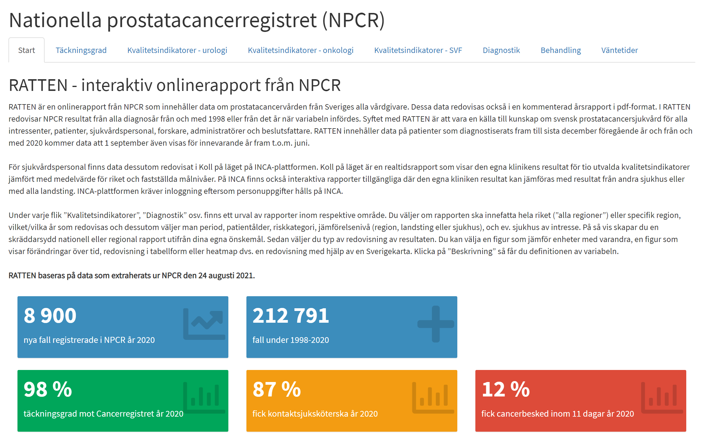
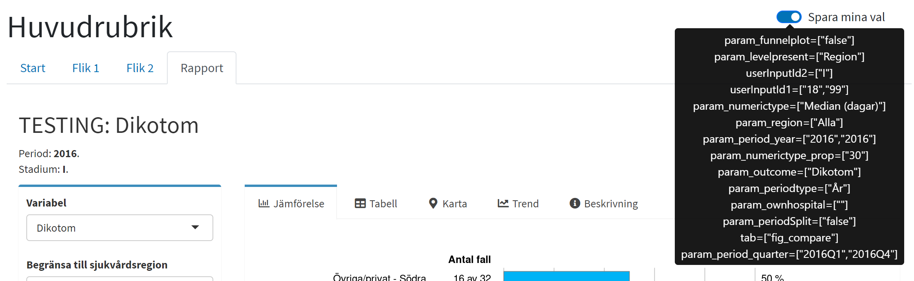
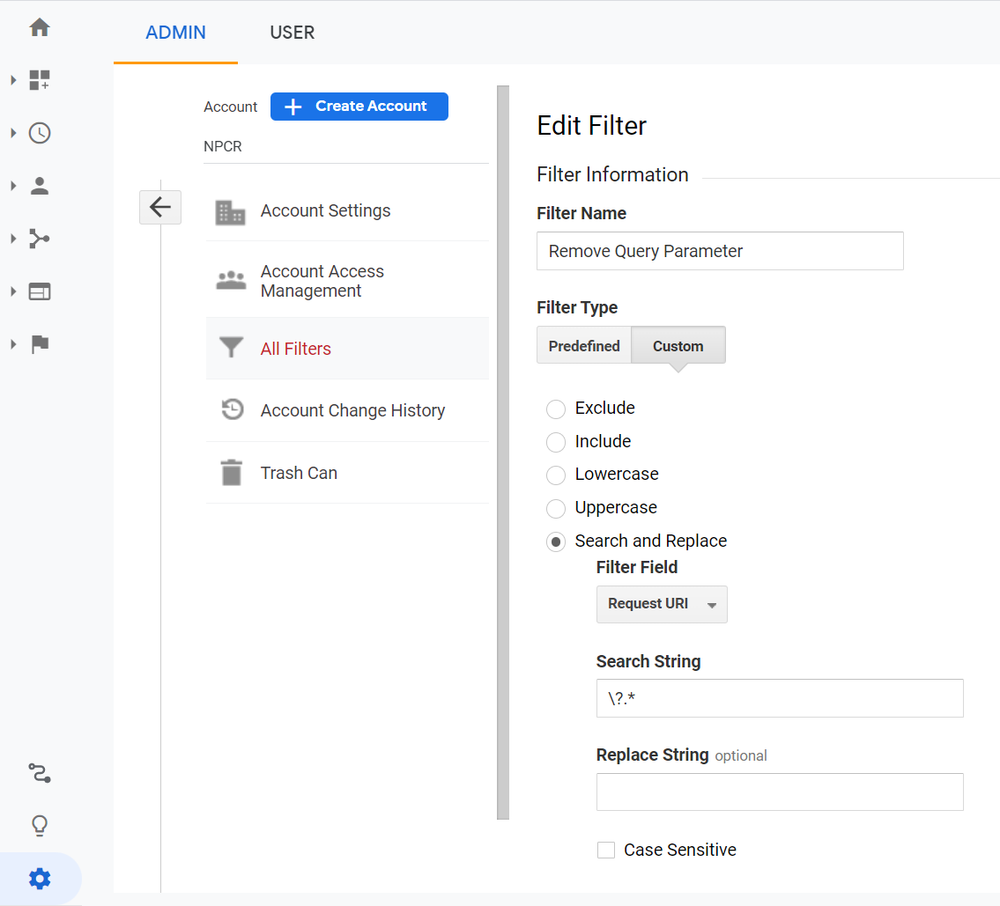

## Vad menas med "startsida"?
Med "startsida" avses här den webbsida för ett registers interaktiva årsrapport där användaren i en menyrad kan välja att ladda olika (interaktiva) rapporter, exempelvis sådana skapade med rccShiny. Sidan är ett html-dokument som använder sig av Bootstrap och JavaScript. 

Se exempel från Nationella prostatacancerregistret (NPCR) nedan:

{width="60%"}

## Skapa startsida för ert register
Exempelkod att utgå ifrån finns att hämta i rccShiny-kanalen på Cancercentrums Teams. För mer information, kontakta er regionala supportperson för rccShiny.

Justeringar i denna kod kan göras för att anpassa sidan till ert register, exempelvis genom att ändra rubriker och lägga till menyval. 

I koden finns en sektion med följande innehåll:

```javascript
var registerPrefix = 'test',
    language = 'sv',
    varsRetainArray = []
;
```

I denna sektion ska värdet på variabeln *registerPrefix* ändras till det prefix som används för aktuellt register. Detta prefix används i kombination med *language* som sökväg till apparna enligt *registerPrefix_language_rapportnamn*. Har man t.ex. laddat upp alla appar för ett register med namn i URL:en enligt t.ex. *register1_sv_rapport1*, *test_sv_rapport2*, etc. ska *registerPrefix* sättas till *'register1'*.

Länken till rapporten skapas sedan genom att ange *rapport1* i följande rad i kodsektionen för själva menyn (där "Rapport" ersätts med valfritt namn på appen):

```html
<li class='appLi'><a data-toggle='pill' href='#appDiv' class='appLink' id='rapport1'>Rapport</a></li>
```
Om sidan ligger på statistik.incanet.se blir då sökvägen som används till appen: https://statistik.incanet.se/register1_sv_rapport1

## Möjlighet att använda flera språk på startsidan
Exempelkoden för startsidan innehåller funktionalitet för att visa innehållet på flera språk. Som exempel finns svenska och engelska med. Vill man använda dessa två språk måste länkarna till rapporter etc. anges för varje språk på rätt ställe i koden. Vid frågor kring detta steg, kontakta er regionala supportperson för rccShiny.

Vill man endast använda ett språk kan man enkelt ta bort detta val genom att kommentera bort eller helt ta bort koden som placerar knapparna för att välja språk överst på sidan:

```html
<!-- Kommentera bort/ta bort nedanstående sektion för att deaktivera val av språk -->
<div class='container-fluid'>
  <ul class='nav nav-pills'>
    <li class='nav-item'><a class='nav-link languageLink' data-bs-toggle='pill' href='#' id='sv'>svenska</a></li>
    <li class='nav-item'><a class='nav-link languageLink' data-bs-toggle='pill' href='#' id='en'>english</a></li>
  </ul>
</div>
```

## Möjlighet att spara användarens val mellan appar
I senaste versionen av rccShiny finns möjligheten att spara användarens parameterval mellan apparna. Detta fungerar genom att en specifik JavaScript-funktion angiven i koden för startsidan anropas varje gång en ändring av val sker i appen. Värdet på alla parameter sparas sedan i en Array och när en ny app ska laddas skickas alla parameterval med i URL:en. För att möjligheten att spara val ska fungera gäller det att använda versioner av både startsidan och rccShiny-paketet som stödjer denna funktionalitet.

Längst upp till höger på startsidan finns en knapp för att sätta på/stänga av sparandet av val mellan appar. Är valet aktiverat visas sparade val i en tooltip om muspekaren hålls över knappen:

{width="100%"}

### Använda Google Analytics tillsammans med möjligheten att spara val mellan appar

Möjligheten att tillåta användaren att spara sina parameterval mellan olika appar använder sig av så kallade *URL query parameters*, dvs. värdet på de olika parametrarna skickas med i webbadressen till respektive app. När detta används tillsammans med Google Analytics uppstår ett problem, då hela adressen, inklusive parameterval, sparas och redovisas som separata webbsidor i Google Analytics. Som tur är finns en enkel workaround för detta, och det är att helt enkelt instruera Google Analytics att i redovisningen filtrera bort hela strängen med parameterval. Besök på samma app men med olika parameterval redovisas då under samma webbadress. Observera dock att hela adressen, inklusive *URL query parameters*, med denna lösning sparas av Google Analytics, då det bara är själva redovisningen som filtreras. Ingen information går alltså förlorad.

Logga in på Google Analytics, gå till *Admin* (kugghjulet längst ner till vänster), välj *All filters* och sedan *Add filter*. Sätt ett valfritt filternamn, välj *Search and replace*, välj sedan *Request URI* under *Filter Field* och skriv följande under *Search String*:
```
\?.*
```
Lämna allt övrigt som det är (se exempel nedan). Gå sedan tillbaka till besöksstatistiken och verifiera att parametersträngen är bortfiltrerad i redovisningen.

{width="100%"}
