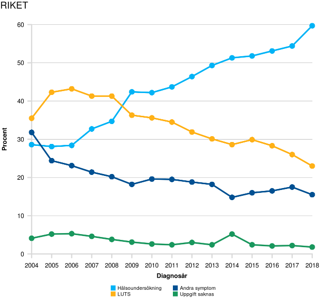

## Instruktioner för användande av de interaktiva shinyrapporterna

Detta dokumentet är tänkt att vara till hjälp för användare av våra
interaktiva årsrapporter (Shinyrapporter) som finns att hitta på
https://www.cancercentrum.se/samverkan/vara-uppdrag/statistik/kvalitetsregisterstatistik/interaktiva-rapporter/.
Figurerna som genereras i dessa rapporter kan sparas till din dator. Om
du högerklickar på en figur så kan du välja "Spara bild som" och sedan
spara figuren på din dator om du behöver använda den till t.ex. en
presentation.

## Val av indikator

När en interaktiv årsrapport öppnas finner du till att börja med en
startsida. Där finns information från registret om rapporten. Du finner
även en flikmeny högst upp på sidan under rubriken. Dessa flikar är
kapitlen som finns i det aktuella registret.

{width=100%}

När du klickar på en flik visas de indikatorer som finns i den filken i
en undermeny. För att se en av dessa indikatorer klickar du på den och
så ska figuren öppnas nedanför.

{width=100%}

## Urvalsdialog

När du har öppnat en indikator kommer denna att visas under menyn. Du
kommer då att se en figur till höger och till vänster finns en
urvalsruta där du kan göra urval för den öppnade indikatorn. Om du
ändrar ett urval så kommer figuren/tabellen att laddas om och den nya
figuren/tabellen baseras på dina urval. Figurerna/tabellerna uppdateras
i realtid direkt du ändrar något urval.

{width=60%}

Under titeln för indikatorn återfinns de aktuella urvalen som är gjorda.
Om urval på en variabel inte är gjort utan samtliga möjliga val är valda
kommer denna variabel ej att stå i listan.

{width=60%}

## Resultat

När du gjort dina urval finner du den uppdaterade indikatorn till höger.
Det finns en meny där som kan se ut på lite olika sätt beroeden på vad
för typ av indikator det är och vad registret valt att visa.

{width=80%}
{width=68%}

Under **Jämförelse** hittar du stapelfigurer. De är
uppdelade på antingen Region, Sjukvårdsregion eller Sjukhus. Om
registret valt att ha med fler än en jämförelsenivå kommer dessa att
kunna väljas bland urvalen till vänster. Vad som visas beror på
indikatorn. Det kan t.ex. vara antalet som fått en viss behandling eller
fördelning av tumörstadium som så kallade stackade staplar. Om det är en
ledtid kommer som standard mediantiden att visas men det kan även finnas
möjlighet att välj att se andelen inom X dagar om registret valt att
inkludera detta. Ett grönt skuggat område bakom staplarna betyder att
registret har valt att ha en målnivå för indikatorn. Målet är uppnått om
stapeln går över det det skuggade området. Ett gult skuggat område
betyder att målnivån har 2 nivåer och det gula är ett lättare mål att
uppnå.

{width=50%}
{width=50%}

Under **Tabell**, **Tabell (Antal)** och **Tabell (Andel)** hittar du tabeller över de data som
presenteras i Jämförelse-fliken. Vilken/Vilka av de 3 tabell-flikarna
som visas beror på vad det är för typ av indikator. Via kapparna i
tabellerna kan antalssiffrona hämtas hem i lite olika format, Excel,
PDF, eller i utskriftsformat.

{width=100%}

Under **Trend** hittar du trender över per år över data
enligt dina urval (du får dock alltid samtliga år här). Hur trenderna
ser ut beror på vad det är för typ av didikator som du tittar på. För
kategoriska indikatorer, som t.ex. fördelning av tumörstadium, är
trenderna rikets siffror. Du kan då också välja att visa trendkurvan för
ett specifikt sjukhus, län eller region. För indikatorer som t.ex. andel
som fått en viss typ av behandling kommer trenderna vara över andelar
för sjukvårdsregionerna samt riket. Här kan du även lägga till ett
specifikt sjukhus trendkurva om registret presenterar data på
sjukhusnivå.

{width=50%}
{width=50%}

Under **Karta** hittar du indikatorn på kartform, denna
finns endast med om landsting är en av jämförelsenivåerna och figuren
inte är en så kallad stackad stapel. Län som är gråa har ej tillräckligt
med data för att visa resultatet.

{width=50%}

Under **Beskrivning** hittar du information om indikatorn.
Där kan du hitta 3 underrubriker, Om indikatorn, Att tänka på vid
tolkning samt Teknisk beskrivning. Om du har någon fundering kring en
indikator kan du titta här för att förhoppningsvis få svar på din
fundering.

{width=100%}
